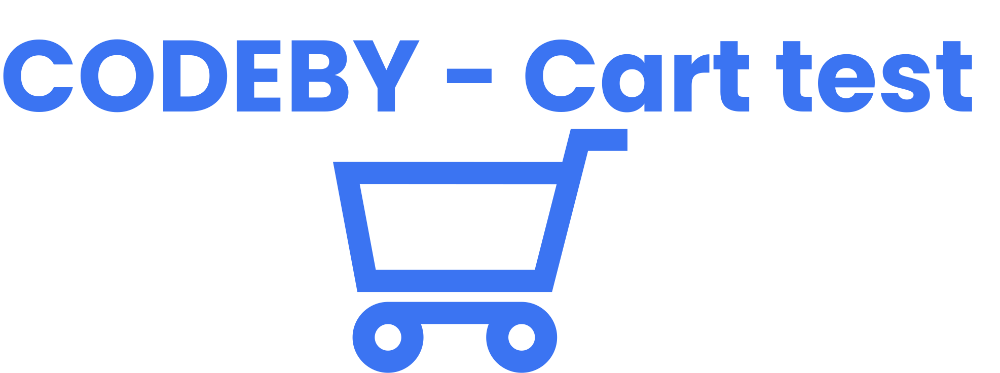
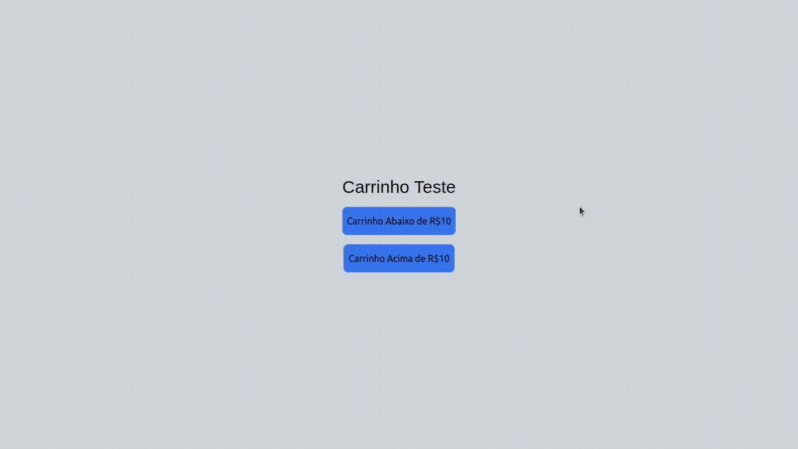

 
 

<h1 align="center">
   
</h1>
 

  <a href="#about"> About </a> &nbsp;&nbsp;&nbsp;| &nbsp;&nbsp;&nbsp;
  <a href="#application-features">Gifs</a> &nbsp;&nbsp;&nbsp;|&nbsp;&nbsp;&nbsp;
  <a href="#getting-started">Getting started </a> &nbsp;&nbsp;&nbsp;|&nbsp;&nbsp;&nbsp;
  <a href="#techs">Techs</a> &nbsp;&nbsp;&nbsp;|&nbsp;&nbsp;&nbsp;
  <a href="#license">License</a>

  
    
  
  

## Outra versão mais completa do projeto: <a  target="_blanck" href="https://github.com/eulazzo/cart_candy_v1">Clique aqui</a>

* ## Features
  * Consumir api `abaixo.json`mostrar todos os produtos no `meu carrinho`,  como a soma total é menor que R$10 a mensagem frete grátis não é exibida
  * Consumir api `acima.json`  listar os produtos no meu `meu carinho`, como a soma total é superior a R$10 a mensagem de frete grátis é exibida. 

## Arquivo json foi alocado à pasta `public` do projeto.
 

## Deployed On Vercel
#### Click on the button below to check it out

